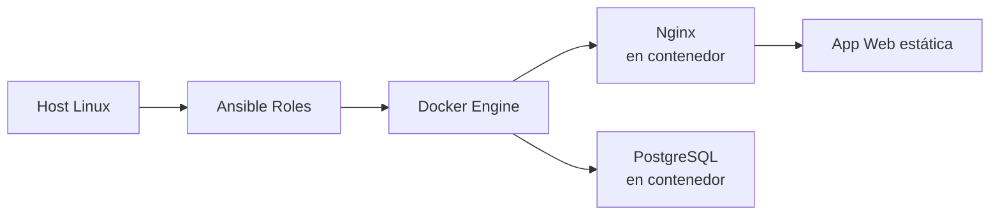

# 🚀 DevOps Lab – Automated Infrastructure & Web Deployment

This serves as a practice environment for automated, containerized application deployment.

- Automation via **Ansible**
- Containerization and local orchestration with **Docker & Docker‑Compose**
- Reproducible deployment of a **static web application + Postgres database**
- Modular infrastructura ready to scalate with **Terraform**

The goal is to replicate a real E2E automated deployment workflow.

---

## Architecture



---

## 📦 Tech Stack

### 🔧 Automation — *Ansible*

- Role **common**:
  - System upgrade
  - Dependencies installation
- Role **webapp**:
  - Clones the repository
  - Docker stack deployment via `docker-compose`

### 🐳 Containers — *Docker*

- **Dockerfile** based on `nginx:alpine` for maximum efficiency
- **docker-compose.yaml** with:
  - Service **web**
  - Service **db** (PostgreSQL)
  - Internal network (`devops-network`)

### 🌐 Web App

- Modern HTML page using **TailwindCSS**
- Served by Nginx within a Docker container

---

## 📁 Project Structure

```bash
ansible/  
│ inventory/hosts.ini  
│ ansible.cfg  
│ site.yml  
│  
└── roles/  
     ├── common/  
     │    └── tasks/main.yml  
     └── webapp/  
          ├── tasks/main.yml  
          └── vars/main.yml  

docker/  
├── app/  
│   ├── Dockerfile  
│   ├── index.html  
└── docker-compose.yaml  
```

---

## ▶️ Deploy execution

### 1. Access hosts

Default inventory ( modify as needed):

```bash
[webserver]
localhost:2224
```

### 2. Launch Ansible playbook

```bash
ansible-playbook ansible/site.yml
```

This:

1. Upgrades system
2. Dependency installation
3. Clones repository
4. Deploy the containers via Docker-Compose

---

## 🛠 Improvements roadmap

- Add Terraform to automatically create the host
- Integrate GitHub Actions (CI/CD → linting, testing, building, deploying)
- Implement health checks on the containers
- Move sensitive variables to a .env file
- Add monitoring (Prometheus + Grafana)

## 👤 Author

**Jaime Fraile López**  

- SysAdmin & DevOps Engineer in progress 🚀  
[LinkedIn](https://www.linkedin.com/in/jaime-fraile-lopez) | [GitHub](https://github.com/fraylope)
