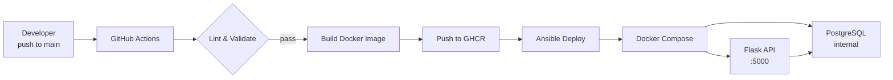

# 🚀 DevOps Lab – Automated Infrastructure & Web Deployment


This serves as a hands-on practice DevOps environment.

## What this project covers

- **CI/CD** — GitHub Actions pipeline: lint → build → push to GHCR
- **Containerization** — Multi-stage Docker build, Docker Compose with health checks
- **Automation** — Ansible roles for provisioning and deployment
- **API** — Flask REST API connected to PostgreSQL
- **Infrastructure as Code** — Terraform *(coming in next iteration)*

The goal is to replicate a real E2E automated deployment workflow.

---

## Architecture



---

## 📦 Tech Stack

| Layer | Technology |
|---|---|
| CI/CD | GitHub Actions |
| Container Registry | GitHub Container Registry (GHCR) |
| Containerization | Docker, Docker Compose |
| API | Python, Flask |
| Database | PostgreSQL 16 |
| Automation | Ansible |
| IaC | Terraform *(planned)* |

---

## API Endpoints

| Method | Endpoint | Description |
|---|---|---|
| GET | `/` | Web UI |
| GET | `/health` | Health check |
| GET | `/items` | List all items |
| GET | `/items/<id>` | Get item by ID |

---

## 📁 Project Structure

```bash
.github/
└── workflows/
└── ci.yml              # CI/CD pipeline
ansible/
├── inventory/
│   └── hosts.ini
├── roles/
│   ├── common/             # System setup
│   └── webapp/             # App deployment
├── requirements.yml
└── site.yml
docker/
├── app/
│   ├── Dockerfile          # Multi-stage build
│   ├── main.py             # Flask API
│   └── requirements.txt
├── docker-compose.yaml
└── .env.example            # Copy to .env and fill values
```

---

## Run locally

```bash
# 1. Clone
git clone https://github.com/fraylope/DevOps-Lab.git
cd DevOps-Lab

# 2. Configure environment
cp docker/.env.example docker/.env
# Edit docker/.env with your values

# 3. Start
cd docker
docker compose up --build

# 4. Test
curl http://localhost:5000/health
curl http://localhost:5000/items
```

---

## 🛠 Improvements roadmap

- [x] Flask API + PostgreSQL
- [x] Docker multi-stage build with health checks
- [x] GitHub Actions CI pipeline (lint + GHCR push)
- [ ] Terraform — provision cloud VM
- [ ] Ansible deploy to real remote server
- [ ] Nginx frontend
- [ ] Monitoring — Prometheus + Grafana

---

## 👤 Author

**Jaime Fraile López**  

- SysAdmin & DevOps Engineer in progress 🚀  
[LinkedIn](https://www.linkedin.com/in/jaime-fraile-lopez) | [GitHub](https://github.com/fraylope)
